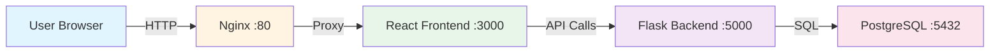
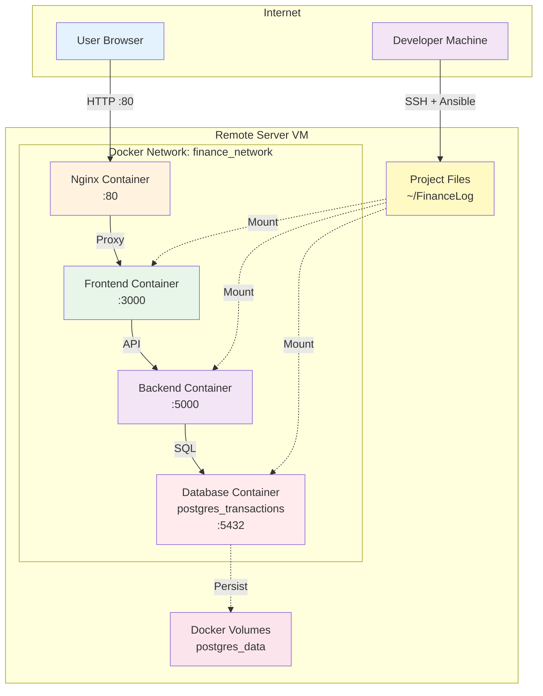
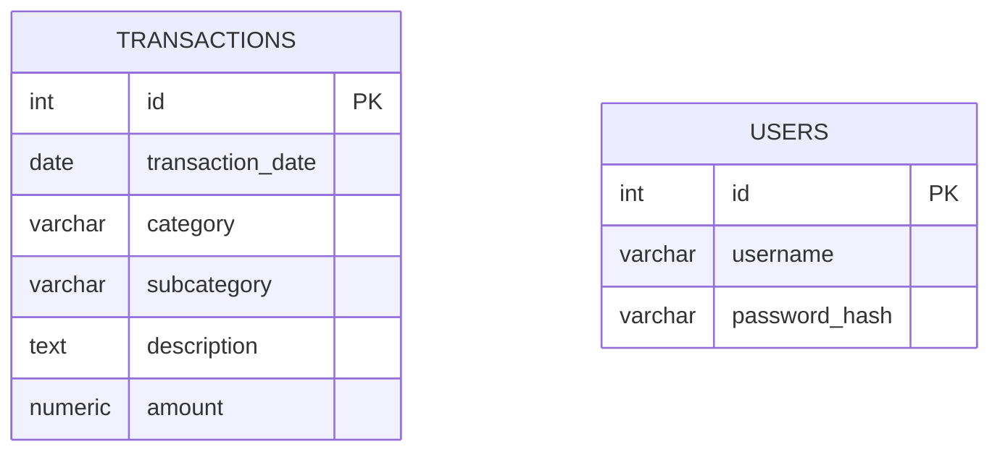
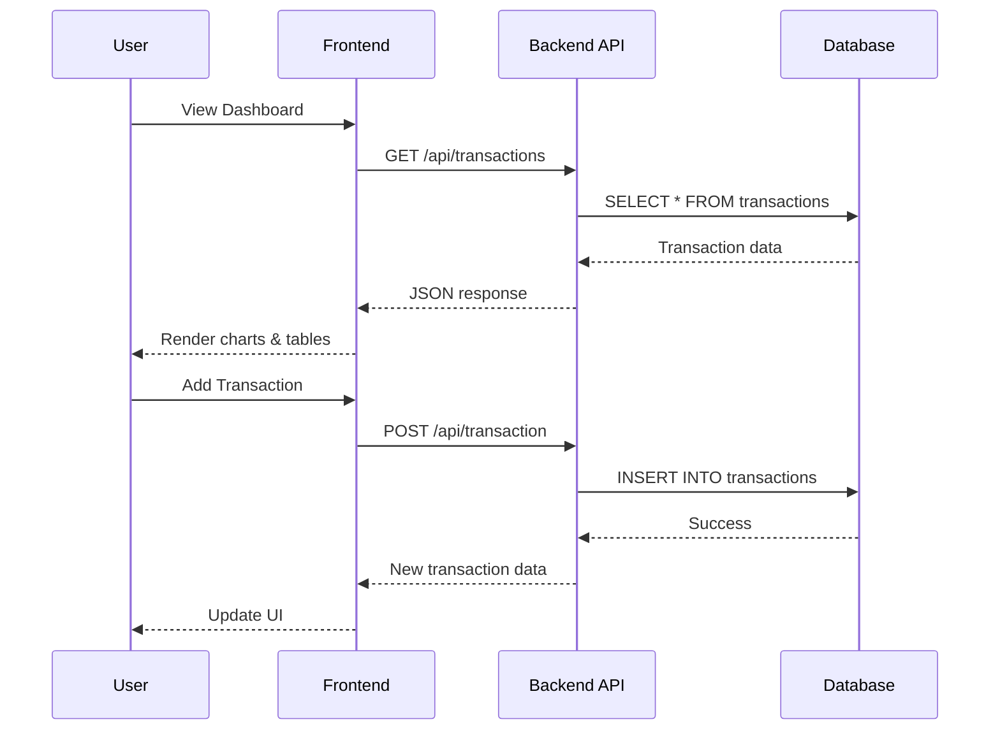
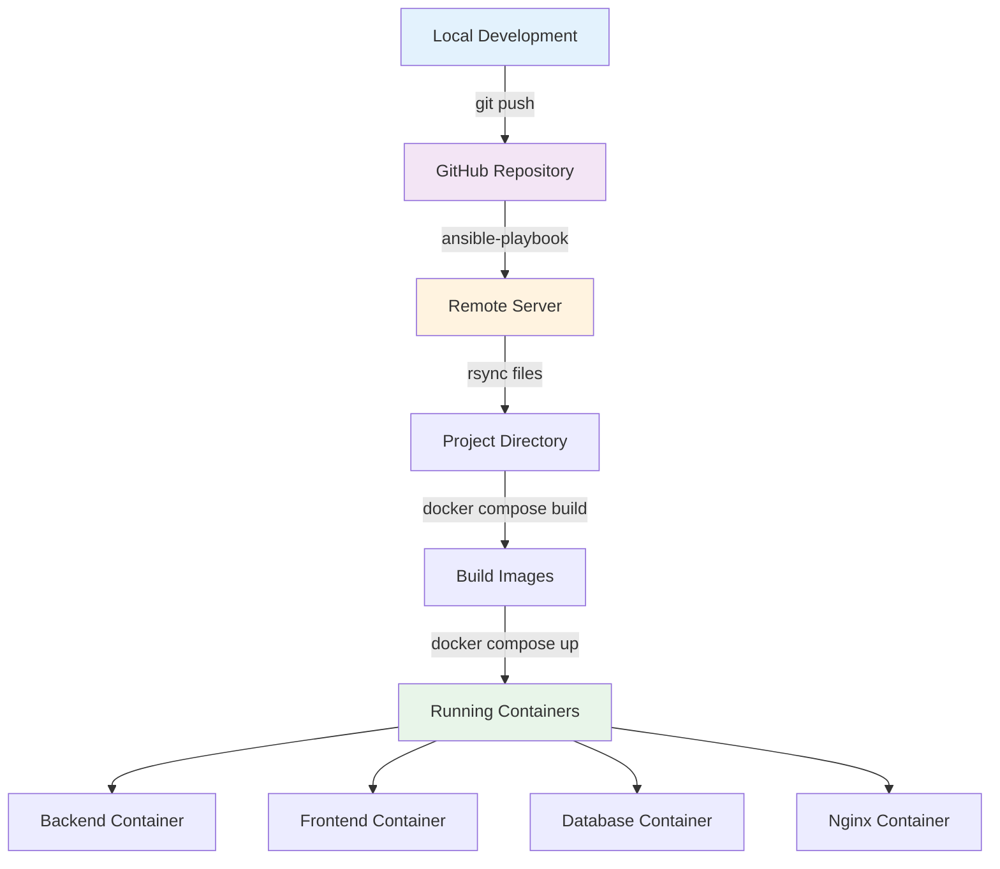
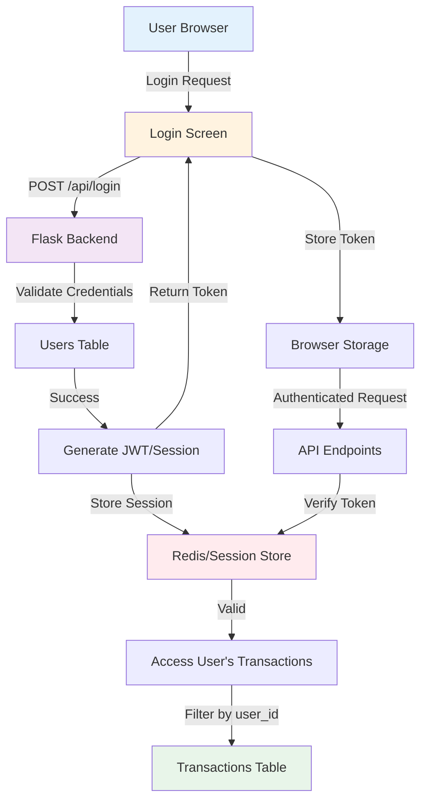
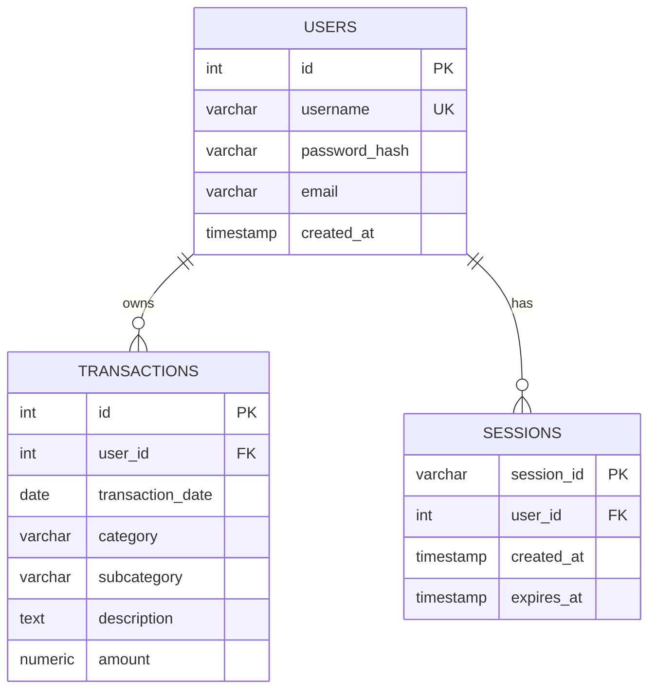

# FinanceLog

A personal finance tracking application for managing income and expenses with visual analytics.

## ⚠️ Security Notice

**Before deploying this application:**
1. Change all default passwords and credentials
2. Generate a strong SECRET_KEY for Flask
3. Use strong database passwords
4. Never commit `.env` files or credentials to version control
5. Review and update all configuration files with your specific values

See the [Configuration](#configuration) section for detailed setup instructions.

## Project Structure

```
FinanceLog/
├── backend/           # Flask API server
├── frontend/          # React web application
├── database/          # PostgreSQL database
└── deployment/        # Ansible deployment scripts
```

## Architecture

### Application Architecture



### VM Infrastructure



## Tech Stack

- **Backend**: Flask (Python), SQLAlchemy ORM
- **Frontend**: React, Recharts for visualizations, Tailwind CSS
- **Database**: PostgreSQL 17
- **Deployment**: Docker Compose, Ansible

## Key Components

### Backend (`backend/`)
- **`app/routes.py`** - API endpoints (GET/POST/PUT/DELETE transactions)
- **`app/models.py`** - Database models (Transaction, User)
- **`config.py`** - Database connection and environment config
- **`run.py`** - Application entry point

### Frontend (`frontend/src/`)
- **`components/Dashboard.js`** - Main dashboard with charts
- **`components/TransactionTable.js`** - View/edit/delete transactions with filters
- **`components/TransactionForm.js`** - Add new transactions
- **`components/Categories.js`** - Category breakdown view
- **`components/BarChartView.js`** - Monthly expenditure chart
- **`components/IncomeBarChartView.js`** - Monthly income chart
- **`components/StackedChartView.js`** - Expenditure breakdown by category
- **`api.js`** - API client functions
- **`index.css`** - Global styles and Tailwind config

### Database (`database/`)
- **`init/init.sql`** - Database schema
- **`data/`** - CSV files for initial data import

## Database Schema



**transactions** table:
- `id` - Primary key (auto-increment)
- `transaction_date` - Date of transaction (NOT NULL)
- `category` - Main category (Income/Expense type) (NOT NULL)
- `subcategory` - Subcategory (e.g., store name, income source)
- `description` - Optional description
- `amount` - Transaction amount (positive for income, negative for expenses) (NOT NULL)

**users** table (for future multi-user support):
- `id` - Primary key (auto-increment)
- `username` - Unique username (NOT NULL)
- `password_hash` - Hashed password (NOT NULL)

## API Endpoints

- `GET /api/transactions` - Get all transactions (supports filtering)
- `POST /api/transaction` - Add new transaction
- `PUT /api/transaction/:id` - Update transaction
- `DELETE /api/transaction/:id` - Delete transaction

### API Flow



## Deployment

### Deployment Flow



**Deploy to server:**
```bash
cd deployment
ansible-playbook -i ./ansible/hosts ./ansible/deploy.yml --private-key ~/.ssh/id_rsa --extra-vars "ansible_become_pass=YOUR_PASSWORD"
```

**Local development:**
```bash
# Start all services
docker compose up -d

# Backend runs on: http://localhost:5000
# Frontend runs on: http://localhost:3000
# Database runs on: localhost:5432
```

## Configuration

### Initial Setup

**⚠️ IMPORTANT: Change all default credentials before deployment!**

1. **Frontend Configuration:**
   ```bash
   cp frontend/.env.example frontend/.env
   # Edit frontend/.env and set REACT_APP_API_URL to your server IP/domain
   ```

2. **Docker Environment:**
   ```bash
   cp .env.example .env
   # Edit .env and set secure database credentials and SECRET_KEY
   ```

3. **Deployment Configuration:**
   ```bash
   cp deployment/ansible/hosts.example deployment/ansible/hosts
   # Edit deployment/ansible/hosts and set your server IP and username
   ```

4. **Generate Secure SECRET_KEY:**
   ```bash
   python -c "import secrets; print(secrets.token_hex(32))"
   ```

### Environment Variables

**Frontend (`frontend/.env`):**
- `REACT_APP_API_URL` - Backend API URL (e.g., `http://your-server-ip/api`)
- `GENERATE_SOURCEMAP` - Set to `false` for production

**Backend (`.env` or `docker-compose.yml`):**
- `DATABASE_URL` - PostgreSQL connection string
- `SECRET_KEY` - Flask secret key (use a strong random value)
- `POSTGRES_DB` - Database name
- `POSTGRES_USER` - Database username
- `POSTGRES_PASSWORD` - Database password (use a strong password)

**Deployment (`deployment/ansible/hosts`):**
- Server IP address
- SSH username
- SSH private key path

## Common Tasks

**Add a new chart/visualization:**
- Create component in `frontend/src/components/`
- Import and use in `Dashboard.js` or `Categories.js`

**Modify transaction filters:**
- Edit filter logic in `TransactionTable.js` (search, category, month filters)

**Change styling:**
- Global styles: `frontend/src/index.css`
- Component-specific: Tailwind classes in component files

**Update database schema:**
- Modify `database/init/init.sql`
- Update `backend/app/models.py` to match
- Rebuild database container

**Add new API endpoint:**
- Add route in `backend/app/routes.py`
- Add client function in `frontend/src/api.js`
- Use in React components

## Environment Variables

**Backend:**
- `DATABASE_URL` - PostgreSQL connection string
- `SECRET_KEY` - Flask secret key

**Frontend:**
- `REACT_APP_API_URL` - Backend API URL (e.g., `http://10.0.0.29:5000/api`)

## Database Backups

Database backups are stored in: `~/FinanceLog_Backups/`

To create a new backup:
```bash
docker exec postgres_transactions pg_dump -U admin finance_tracker > ~/FinanceLog_Backups/backup_$(date +%Y%m%d).sql
```

## Future Improvements

### Authentication & Multi-User Support
- [ ] Add login screen
- [ ] Implement user authentication system
- [ ] Separate transaction data per user
- [ ] Store session data (Redis or database-backed sessions)
- [ ] Decide on deployment strategy with authentication (OAuth, JWT, etc.)

#### Planned Authentication Architecture



#### Future Data Model with Auth



### Features
- [ ] Budget tracking and alerts
- [ ] Recurring transaction support
- [ ] Export data to CSV/Excel
- [ ] Mobile responsive improvements
- [ ] Dark mode toggle

### Infrastructure
- [ ] Automated database backups
- [ ] CI/CD pipeline
- [ ] Monitoring and logging
- [ ] HTTPS/SSL configuration

## Notes

- Transactions with positive amounts are income, negative amounts are expenses
- Month filters show in reverse chronological order (latest first)
- Search in TransactionTable matches both description and subcategory fields
- All dashboard cards use consistent styling with `bg-table` class

