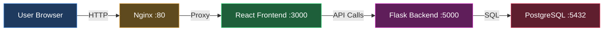
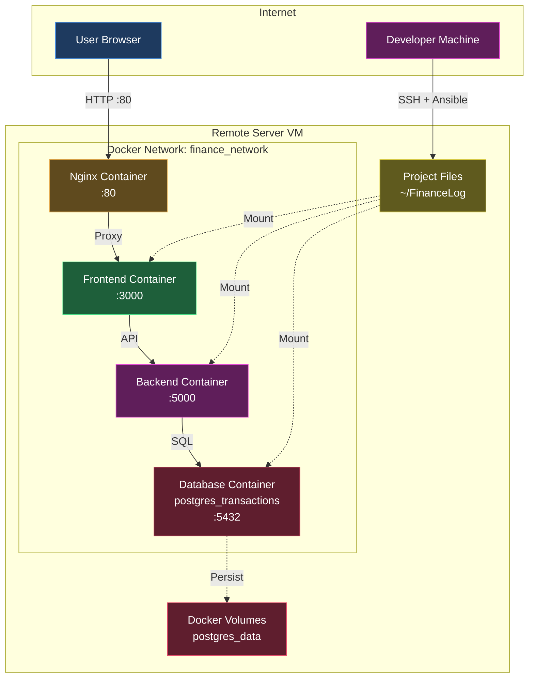
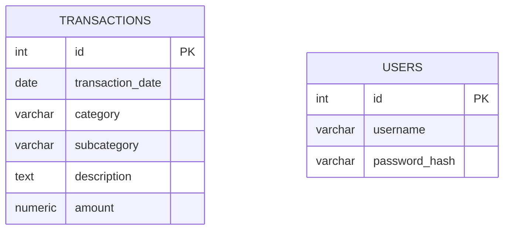
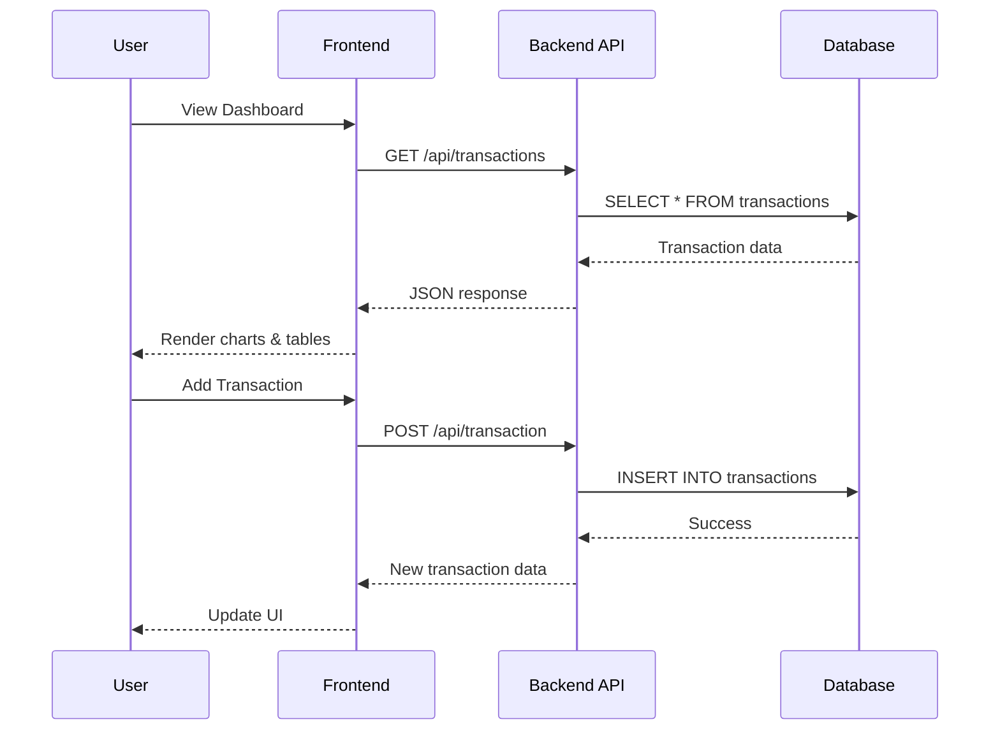
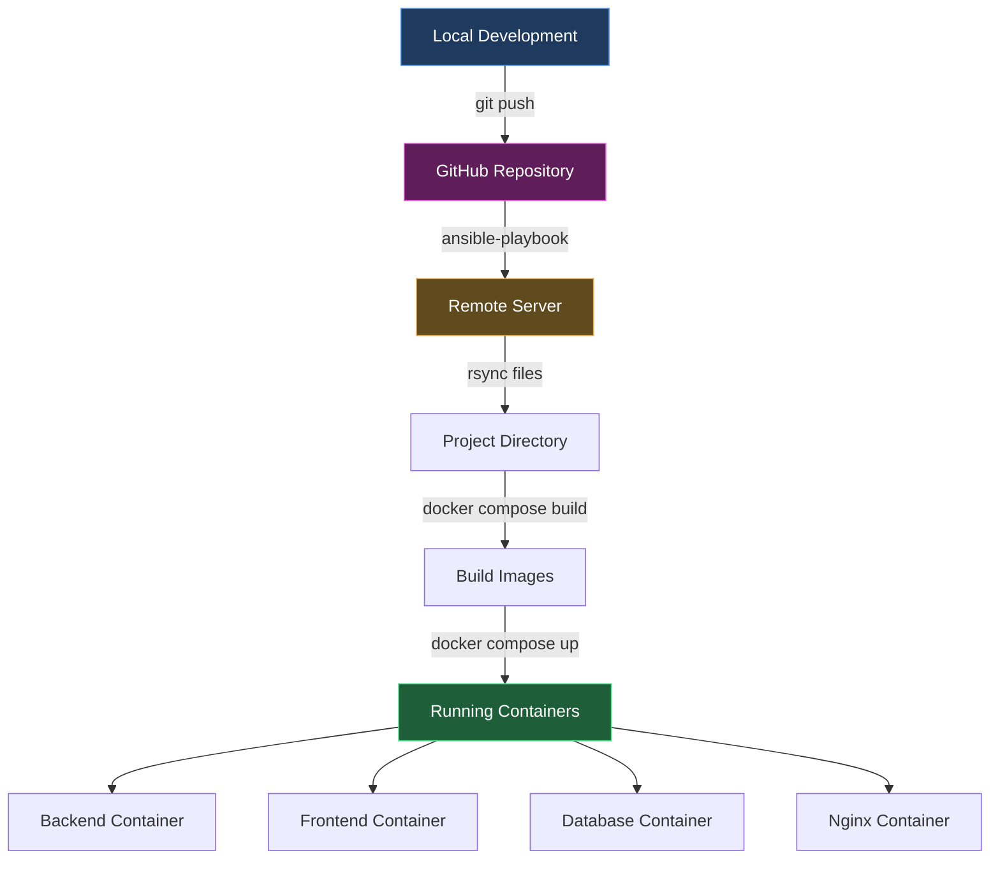
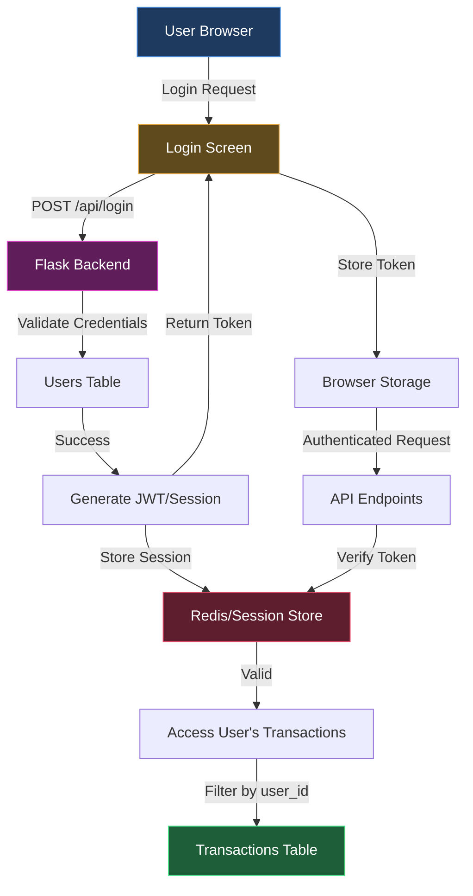
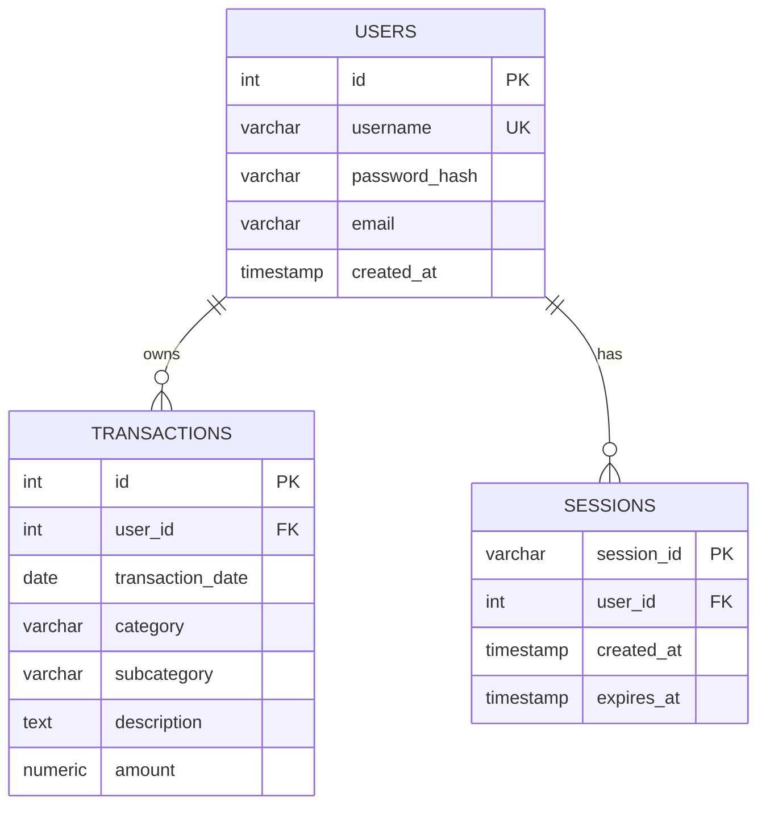

# FinanceLog

A personal finance tracking application for managing income and expenses with visual analytics.

## 🚀 Quick Start

### Prerequisites
- Docker and Docker Compose installed (for local development)
- Ansible installed (for deployment)
- SSH access to remote server (for deployment)

### Deployment Checklist

Before deploying to production:

- [ ] **1. Configure Frontend**
  ```bash
  cp frontend/.env.example frontend/.env
  # Edit REACT_APP_API_URL with your server IP
  ```

- [ ] **2. Configure Backend**
  ```bash
  cp .env.example .env
  # Generate SECRET_KEY: python -c "import secrets; print(secrets.token_hex(32))"
  # Set strong POSTGRES_PASSWORD
  ```

- [ ] **3. Configure Deployment**
  ```bash
  cp deployment/ansible/hosts.example deployment/ansible/hosts
  # Edit with your server IP and SSH username
  ```

- [ ] **4. Deploy**
  ```bash
  cd deployment && ./start_ansible.sh
  # Enter sudo password when prompted
  ```

- [ ] **5. Verify**
  - Visit `http://your-server-ip` in browser
  - Check all containers running: `ssh user@server "docker ps"`

## ⚠️ Security Notice

**Before deploying this application:**
1. ✅ Change all default passwords and credentials
2. ✅ Generate a strong SECRET_KEY for Flask (64-char hex)
3. ✅ Use strong database passwords (16+ characters)
4. ✅ Never commit `.env` files or credentials to version control
5. ✅ Review and update all configuration files with your specific values

See the [Configuration](#configuration) section for detailed setup instructions.

## Project Structure

```
FinanceLog/
├── backend/           # Flask API server
├── frontend/          # React web application
├── database/          # PostgreSQL database
└── deployment/        # Ansible deployment scripts
```

## Architecture

### Application Architecture



### VM Infrastructure



## Tech Stack

- **Backend**: Flask (Python), SQLAlchemy ORM
- **Frontend**: React, Recharts for visualizations, Tailwind CSS
- **Database**: PostgreSQL 17
- **Deployment**: Docker Compose, Ansible

## Key Components

### Backend (`backend/`)
- **`app/routes.py`** - API endpoints (GET/POST/PUT/DELETE transactions)
- **`app/models.py`** - Database models (Transaction, User)
- **`config.py`** - Database connection and environment config
- **`run.py`** - Application entry point

### Frontend (`frontend/src/`)
- **`components/Dashboard.js`** - Main dashboard with charts
- **`components/TransactionTable.js`** - View/edit/delete transactions with filters
- **`components/TransactionForm.js`** - Add new transactions
- **`components/Categories.js`** - Category breakdown view
- **`components/BarChartView.js`** - Monthly expenditure chart
- **`components/IncomeBarChartView.js`** - Monthly income chart
- **`components/StackedChartView.js`** - Expenditure breakdown by category
- **`api.js`** - API client functions
- **`index.css`** - Global styles and Tailwind config

### Database (`database/`)
- **`init/init.sql`** - Database schema
- **`data/`** - CSV files for initial data import

## Database Schema



**transactions** table:
- `id` - Primary key (auto-increment)
- `transaction_date` - Date of transaction (NOT NULL)
- `category` - Main category (Income/Expense type) (NOT NULL)
- `subcategory` - Subcategory (e.g., store name, income source)
- `description` - Optional description
- `amount` - Transaction amount (positive for income, negative for expenses) (NOT NULL)

**users** table (for future multi-user support):
- `id` - Primary key (auto-increment)
- `username` - Unique username (NOT NULL)
- `password_hash` - Hashed password (NOT NULL)

## API Endpoints

- `GET /api/transactions` - Get all transactions (supports filtering)
- `POST /api/transaction` - Add new transaction
- `PUT /api/transaction/:id` - Update transaction
- `DELETE /api/transaction/:id` - Delete transaction

### API Flow



## Deployment

### Deployment Flow



### Quick Start

**Deploy to server:**
```bash
cd deployment
./start_ansible.sh
```

**First deployment:**
- Prompts for sudo password (to install Docker and add user to docker group)
- Takes ~5-10 minutes (downloads Docker, builds images)

**Subsequent deployments:**
- Still prompts for sudo password, but skips most sudo tasks
- Takes ~30-60 seconds (only rebuilds changed images)
- No password stored anywhere - secure by design!

**Manual deployment:**
```bash
cd deployment
ansible-playbook -i ./ansible/hosts ./ansible/deploy.yml --private-key ~/.ssh/id_rsa --ask-become-pass
```

### Local Development

```bash
# Start all services
docker compose up -d

# Backend runs on: http://localhost:5000
# Frontend runs on: http://localhost:3000
# Database runs on: localhost:5432

# View logs
docker compose logs -f

# Stop services
docker compose down
```

## Configuration

### Initial Setup

**⚠️ IMPORTANT: Change all default credentials before deployment!**

#### 1. Frontend Configuration
```bash
cp frontend/.env.example frontend/.env
# Edit frontend/.env and set REACT_APP_API_URL to your server IP/domain
```

**Example `frontend/.env`:**
```env
REACT_APP_API_URL=http://10.0.0.29/api
GENERATE_SOURCEMAP=false
```

#### 2. Docker Environment
```bash
cp .env.example .env
# Edit .env and set secure database credentials and SECRET_KEY
```

**Example `.env`:**
```env
POSTGRES_DB=finance_tracker
POSTGRES_USER=admin
POSTGRES_PASSWORD=your_secure_password_here
SECRET_KEY=your_64_char_hex_secret_key_here
```

**Generate a secure SECRET_KEY:**
```bash
python -c "import secrets; print(secrets.token_hex(32))"
```

#### 3. Deployment Configuration
```bash
cp deployment/ansible/hosts.example deployment/ansible/hosts
# Edit deployment/ansible/hosts and set your server IP and username
```

**Example `deployment/ansible/hosts`:**
```ini
[webservers]
10.0.0.29 ansible_user=mats
```

**How it works:**
- ✅ **First deployment:** Ansible installs Docker and adds your user to the `docker` group
- ✅ **Subsequent deployments:** Docker commands run without sudo (faster, cleaner)
- ✅ **No password storage:** Your sudo password is never stored anywhere
- ✅ **Secure by design:** Industry-standard approach using Docker group permissions

### Environment Variables Reference

| Variable | File | Description | Example |
|----------|------|-------------|---------|
| `REACT_APP_API_URL` | `frontend/.env` | Backend API URL | `http://10.0.0.29/api` |
| `GENERATE_SOURCEMAP` | `frontend/.env` | Generate source maps | `false` (production) |
| `POSTGRES_DB` | `.env` | Database name | `finance_tracker` |
| `POSTGRES_USER` | `.env` | Database username | `admin` |
| `POSTGRES_PASSWORD` | `.env` | Database password | `strong_password_123` |
| `SECRET_KEY` | `.env` | Flask secret key | `64-char hex string` |
| `ansible_user` | `deployment/ansible/hosts` | SSH username | `mats` |
| Server IP | `deployment/ansible/hosts` | Remote server IP | `10.0.0.29` |

## Common Tasks

**Add a new chart/visualization:**
- Create component in `frontend/src/components/`
- Import and use in `Dashboard.js` or `Categories.js`

**Modify transaction filters:**
- Edit filter logic in `TransactionTable.js` (search, category, month filters)

**Change styling:**
- Global styles: `frontend/src/index.css`
- Component-specific: Tailwind classes in component files

**Update database schema:**
- Modify `database/init/init.sql`
- Update `backend/app/models.py` to match
- Rebuild database container

**Add new API endpoint:**
- Add route in `backend/app/routes.py`
- Add client function in `frontend/src/api.js`
- Use in React components

## Troubleshooting

### Deployment Issues

**"Permission denied" when running Docker commands:**
```bash
# SSH into the server and verify docker group membership
ssh mats@10.0.0.29
groups
# Should show: mats docker ...

# If not in docker group, log out and back in
exit
ssh mats@10.0.0.29
```

**Ansible playbook fails:**
```bash
# Check syntax
cd deployment
ansible-playbook -i ./ansible/hosts ./ansible/deploy.yml --syntax-check

# Run with verbose output
./start_ansible.sh -vvv
```

**Docker containers not starting:**
```bash
# SSH into server
ssh mats@10.0.0.29

# Check container status
docker ps -a

# View logs
docker compose -f ~/FinanceLog/docker-compose.yml logs

# Restart containers
cd ~/FinanceLog
docker compose down
docker compose up -d
```

**Frontend can't connect to backend:**
- Verify `REACT_APP_API_URL` in `frontend/.env` matches your server IP
- Check Nginx is running: `docker ps | grep nginx`
- Test backend directly: `curl http://your-server-ip/api/transactions`

### Local Development Issues

**Port already in use:**
```bash
# Find process using port 5000 (backend)
lsof -i :5000
kill -9 <PID>

# Or use different ports in docker-compose.yml
```

**Database connection errors:**
```bash
# Verify database is running
docker ps | grep postgres

# Check database logs
docker logs postgres_transactions

# Reset database
docker compose down -v  # WARNING: Deletes all data!
docker compose up -d
```

## Database Backups

### Manual Backup

```bash
# Create backup directory
mkdir -p ~/FinanceLog_Backups

# Create backup
docker exec postgres_transactions pg_dump -U admin finance_tracker > ~/FinanceLog_Backups/backup_$(date +%Y%m%d_%H%M%S).sql
```

### Restore from Backup

```bash
# Stop the application
cd ~/FinanceLog
docker compose down

# Start only the database
docker compose up -d database

# Restore backup
cat ~/FinanceLog_Backups/backup_20260104_120000.sql | docker exec -i postgres_transactions psql -U admin finance_tracker

# Start all services
docker compose up -d
```

### Automated Backups (Optional)

Add to crontab on the server:
```bash
# Edit crontab
crontab -e

# Add daily backup at 2 AM
0 2 * * * docker exec postgres_transactions pg_dump -U admin finance_tracker > ~/FinanceLog_Backups/backup_$(date +\%Y\%m\%d).sql

# Keep only last 30 days of backups
0 3 * * * find ~/FinanceLog_Backups -name "backup_*.sql" -mtime +30 -delete
```

## Future Improvements

### Authentication & Multi-User Support
- [ ] Add login screen
- [ ] Implement user authentication system
- [ ] Separate transaction data per user
- [ ] Store session data (Redis or database-backed sessions)
- [ ] Decide on deployment strategy with authentication (OAuth, JWT, etc.)

#### Planned Authentication Architecture



#### Future Data Model with Auth



### Features
- [ ] Budget tracking and alerts
- [ ] Recurring transaction support
- [ ] Export data to CSV/Excel
- [ ] Mobile responsive improvements
- [ ] Dark mode toggle

### Infrastructure
- [ ] Automated database backups
- [ ] CI/CD pipeline
- [ ] Monitoring and logging
- [ ] HTTPS/SSL configuration

## Notes

- Transactions with positive amounts are income, negative amounts are expenses
- Month filters show in reverse chronological order (latest first)
- Search in TransactionTable matches both description and subcategory fields
- All dashboard cards use consistent styling with `bg-table` class

